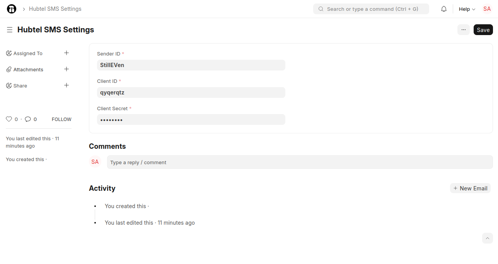
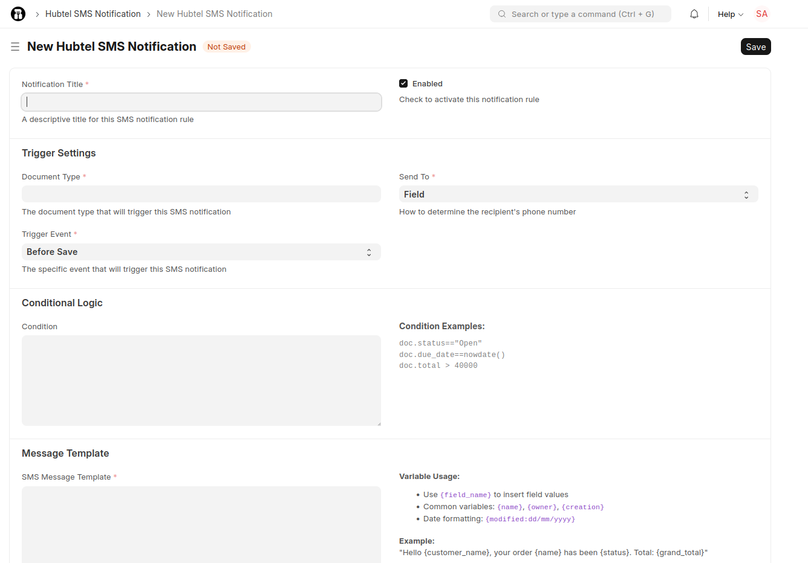

# Hubtel SMS App

A Frappe app for sending SMS notifications using the Hubtel SMS Gateway. This app provides a comprehensive SMS notification system that can automatically send SMS messages based on document events in your Frappe/ERPNext system.

## Features

- **SMS Gateway Integration**: Direct integration with Hubtel SMS API
- **Automated Notifications**: Send SMS based on document events (create, update, submit, etc.)
- **Conditional Logic**: Send SMS only when specific conditions are met
- **Template Support**: Use document field variables in SMS messages
- **Retry Logic**: Automatic retry with configurable attempts and intervals
- **Flexible Recipients**: Send to document fields or fixed phone numbers
- **Scheduling**: Support for delayed SMS sending

## Installation

You can install this app using the [bench](https://github.com/frappe/bench) CLI:

```bash
cd $PATH_TO_YOUR_BENCH
bench get-app $URL_OF_THIS_REPO --branch develop
bench install-app hubtel_sms
```

## Configuration

### 1. Hubtel SMS Settings

Before using the SMS functionality, you need to configure your Hubtel SMS credentials. Navigate to **Hubtel SMS Settings** in your Frappe desk.



#### Required Fields:

- **Sender ID**: Your registered sender ID with Hubtel (e.g., "YourCompany")
- **Client ID**: Your Hubtel client ID (provided by Hubtel)
- **Client Secret**: Your Hubtel client secret (provided by Hubtel)

#### How to Configure:

1. Go to **Hubtel SMS Settings** in the Frappe desk
2. Enter your Hubtel credentials:
   - **Sender ID**: The name that will appear as the sender of your SMS
   - **Client ID**: Your Hubtel account client ID
   - **Client Secret**: Your Hubtel account client secret (stored securely as password)
3. Save the settings

> **Note**: You need to have an active Hubtel SMS account to get these credentials. Contact Hubtel for account setup and API access.

### 2. SMS Notifications Configuration

The SMS notification system allows you to create automated SMS rules that trigger based on document events. Navigate to **Hubtel SMS Notification** to create notification rules.



#### Basic Settings

- **Notification Title**: A descriptive name for your notification rule
- **Enabled**: Check to activate this notification rule

#### Trigger Settings

- **Document Type**: Select the Frappe document type that should trigger this SMS (e.g., Sales Order, Customer, etc.)
- **Trigger Event**: Choose when the SMS should be sent:
  - **Before Save**: Before the document is saved
  - **After Insert**: After a new document is created
  - **Before Submit**: Before the document is submitted
  - **On Submit**: When the document is submitted
  - **Before Cancel**: Before the document is cancelled
  - **On Cancel**: When the document is cancelled
  - **On Update After Submit**: When a submitted document is updated
  - **Before Delete**: Before the document is deleted
  - **After Delete**: After the document is deleted
  - **On Change**: When any field in the document changes

#### Recipient Configuration

- **Send To**: Choose how to determine the recipient's phone number:
  - **Field**: Use a phone number field from the document
  - **Fixed Number**: Send to a specific phone number

- **Recipient Phone Field**: (When "Field" is selected) Choose which field contains the phone number
- **Fixed Phone Number**: (When "Fixed Number" is selected) Enter the phone number (e.g., +233201234567)

#### Conditional Logic

- **Condition**: Optional Python expression to determine if SMS should be sent
  - Examples:
    - `doc.status == "Open"`
    - `doc.total > 40000`
    - `doc.due_date == nowdate()`

#### Message Template

- **SMS Message Template**: Your SMS message with variable placeholders
  - Use `{field_name}` to insert document field values
  - Character limit: 160 for single SMS
  - Examples:
    - `"Hello {customer_name}, your order {name} has been {status}. Total: {grand_total}"`
    - `"Your appointment with {patient_name} is scheduled for {appointment_date}"`

#### Advanced Settings

- **Retry Attempts**: Number of times to retry sending SMS if it fails (0-10, default: 3)
- **Retry Interval**: Minutes to wait between retry attempts (1-60, default: 5)
- **Send Immediately**: Check to send SMS immediately when triggered
- **Delay (minutes)**: Minutes to wait before sending SMS (useful for allowing cancellations)

## Usage Examples

### Example 1: Customer Order Confirmation

**Scenario**: Send SMS when a Sales Order is submitted

**Configuration**:
- Document Type: Sales Order
- Trigger Event: On Submit
- Send To: Field
- Recipient Phone Field: customer_mobile
- Condition: `doc.status == "Submitted"`
- Message Template: `"Thank you {customer_name}! Your order {name} for {grand_total} has been confirmed. We'll notify you when it's ready for delivery."`

### Example 2: Payment Reminder

**Scenario**: Send payment reminder for overdue invoices

**Configuration**:
- Document Type: Sales Invoice
- Trigger Event: On Change
- Send To: Field
- Recipient Phone Field: customer_mobile
- Condition: `doc.outstanding_amount > 0 and doc.due_date < nowdate()`
- Message Template: `"Dear {customer_name}, your invoice {name} for {outstanding_amount} is overdue. Please make payment to avoid late fees."`

### Example 3: Appointment Reminder

**Scenario**: Send appointment reminder to patients

**Configuration**:
- Document Type: Patient Appointment
- Trigger Event: After Insert
- Send To: Field
- Recipient Phone Field: patient_mobile
- Condition: `doc.status == "Scheduled"`
- Message Template: `"Hello {patient_name}, your appointment with Dr. {practitioner} is scheduled for {appointment_date} at {appointment_time}. Please arrive 10 minutes early."`

## Message Template Variables

You can use any document field as a variable in your SMS message:

- **Basic fields**: `{name}`, `{owner}`, `{creation}`, `{modified}`
- **Custom fields**: `{customer_name}`, `{total_amount}`, `{status}`
- **Date fields**: Will be formatted as DD/MM/YYYY HH:MM
- **Boolean fields**: Will show as "Yes" or "No"

## Phone Number Format

- Phone numbers should be in international format
- The app automatically cleans phone numbers by removing spaces and special characters
- Valid formats: `+233201234567`, `233201234567`, `0201234567`
- The app will automatically format numbers for the Hubtel API

## Troubleshooting

### Common Issues

1. **SMS not sending**: Check your Hubtel credentials in Settings
2. **Invalid phone number**: Ensure the phone field contains valid numbers
3. **Condition not working**: Verify your Python expression syntax
4. **Template variables not replacing**: Check that field names match exactly

### Error Logs

Check the Frappe error logs for detailed error messages:
- Go to **Tools > Error Log** in the Frappe desk
- Look for entries with "SMS" in the title

## API Usage

You can also send SMS programmatically:

```python
import frappe
from hubtel_sms.utils import send_sms

# Send SMS directly
response = send_sms("233201234567", "Hello from your app!")
```

## Contributing

This app uses `pre-commit` for code formatting and linting. Please [install pre-commit](https://pre-commit.com/#installation) and enable it for this repository:

```bash
cd apps/hubtel_sms
pre-commit install
```

Pre-commit is configured to use the following tools for checking and formatting your code:

- ruff
- eslint
- prettier
- pyupgrade

## License

MIT
